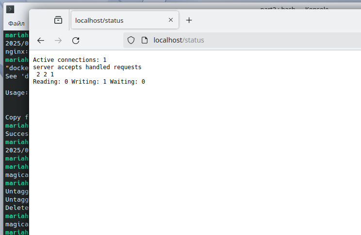
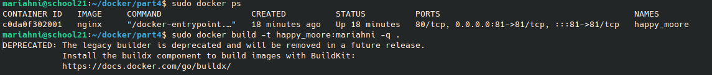
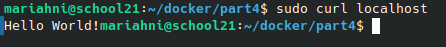

## Contents

Part 1. [Готовый докер](#part-1-ready-made-docker) \
Part 2. [ Операции с контейнером](#part-2-operations-with-container) \
Part 3. [Мини веб-сервер](#part-3-mini-web-server) \
Part 4. [Свой докер](#part-4-your-own-docker) \
Part 5. [Dockle](#part-5-dockle) \
Part 6. [Базовый Docker Compose](#part-6-basic-docker-compose)

## Part 1. Готовый докер

В качестве конечной цели своей небольшой практики ты сразу выбрал написание докер-образа для собственного веб-сервера, а потому в начале тебе нужно разобраться с уже готовым докер-образом для сервера.
Твой выбор пал на довольно простой nginx.

**== Task ==**

##### Возьми официальный докер-образ с nginx и выкачай его при помощи `docker pull`.

##### Проверь наличие докер-образа через `docker images`.

##### Запусти докер-образ через `docker run -d [image_id|repository]`.
##### Проверь, что образ запустился через `docker ps`.

##### Посмотри информацию о контейнере через `docker inspect [container_id|container_name]`.

##### По выводу команды определи и помести в отчёт размер контейнера, список замапленных портов и ip контейнера.

##### Останови докер контейнер через `docker stop [container_id|container_name]`.

##### Проверь, что контейнер остановился через `docker ps`.

##### Запусти докер с портами 80 и 443 в контейнере, замапленными на такие же порты на локальной машине, через команду 'run'.

##### Проверь, что в браузере по адресу localhost:80 доступна стартовая страница nginx.

##### Перезапусти докер контейнер через `docker restart [container_id|container_name]`.
##### Проверь любым способом, что контейнер запустился.

## Part 2.  Операции с контейнером

Докер-образ и контейнер готовы. Теперь можно покопаться в конфигурации nginx и отобразить статус страницы.

**== Задание ==**

##### Прочитай конфигурационный файл nginx.conf внутри докер контейнера через команду exec.

##### Cоздай на локальной машине файл nginx.conf.
##### Настрой в нем по пути /status отдачу страницы статуса сервера nginx.

##### Скопируй созданный файл nginx.conf внутрь докер-образа через команду 'docker cp'.

##### Перезапусти nginx внутри докер-образа через команду *exec*.

##### Проверь, что по адресу localhost:80/status отдается страничка со статусом сервера nginx.

##### Экспортируй контейнер в файл container.tar через команду export.
##### Останови контейнер.

##### Удали образ через  `docker rmi [image_id|repository]`не удаляя перед этим контейнеры.

##### Удали остановленный контейнер.

##### Импортируй контейнер обратно через команду import.
##### Запусти импортированный контейнер.

##### Проверь, что по адресу localhost:80/status отдается страничка со статусом сервера nginx.

## Part 3. Мини веб-сервер

Теперь стоит немного оторваться от докера, чтобы подготовиться к последнему этапу. Время написать свой сервер.

**== Задание ==**

##### Напиши мини-сервер на C и FastCgi, который будет возвращать простейшую страничку с надписью  `Hello World!`.

##### Напиши свой nginx.conf, который будет проксировать все запросы с 81 порта на 127.0.0.1:8080.

##### Положи файл nginx.conf по пути ./nginx/nginx.conf (это понадобится позже).

##### Запусти написанный мини-сервер через spawn-fcgi на порту 8080.

##### Проверь, что в браузере по localhost:81 отдается написанная тобой страничка.

## Part 4.  Свой докер

Теперь всё готово. Можно приступать к написанию докер-образа для созданного сервера.

**== Задание  ==**

*При написании докер-образа избегай множественных вызовов команд RUN*

#### 1) собирает исходники мини сервера на FastCgi из Части 3;
#### 2) запускает его на 8080 порту;
#### 3) копирует внутрь образа написанный ./nginx/nginx.conf;
#### 4) запускает nginx.
nginx можно установить внутрь докера самостоятельно, а можно воспользоваться готовым образом с nginx'ом, как базовым.

##### Собери написанный докер-образ через 'docker build' при этом указав имя и тег.

##### Проверь через docker images, что все собралось корректно.

##### Запусти собранный докер-образ с маппингом 81 порта на 80 на локальной машине и маппингом папки ./nginx внутрь контейнера по адресу, где лежат конфигурационные файлы nginx'а (см. Часть 2).

##### Проверь, что по localhost:80 доступна страничка написанного мини сервера.

##### Допиши в ./nginx/nginx.conf проксирование странички /status, по которой надо отдавать статус сервера nginx.

##### Перезапусти докер-образ.

Если всё сделано верно, то, после сохранения файла и перезапуска контейнера, конфигурационный файл внутри докер-образа должен обновиться самостоятельно без лишних действий.
##### Проверь, что теперь по localhost:80/status отдается страничка со статусом nginx

## Part 5. **Dockle**

После написания образа никогда не будет лишним проверить его на безопасность.

**== Задание  ==**

##### Просканируй образ из предыдущего задания через `dockle [image_id|repository]`.

##### Исправь образ так, чтобы при проверке через dockle не было ошибок и предупреждений.

Ошибка CIS-DI-0010 решается командой -ak NGINX_GPGKEYS -ak NGINX_GPGKEY_PATH

## Part 6. Базовый **Docker Compose**

Вот ты и закончил свою разминку. А хотя погоди...
Почему бы не поэкспериментировать с развёртыванием проекта, состоящего сразу из нескольких докер-образов?

**== Задание  ==**

##### Напиши файл *docker-compose.yml*, с помощью которого:
##### 1) Подними докер-контейнер из Части 5 (он должен работать в локальной сети, т. е. не нужно использовать инструкцию EXPOSE и мапить порты на локальную машину).

##### 2) Подними докер-контейнер с nginx, который будет проксировать все запросы с 8080 порта на 81 порт первого контейнера.
##### Замапь 8080 порт второго контейнера на 80 порт локальной машины.
##### Останови все запущенные контейнеры.
##### Cобери и запусти проект с помощью команд `docker-compose build` и `docker-compose up`.

##### Проверь, что в браузере по localhost:80 отдается написанная тобой страничка, как и ранее.

